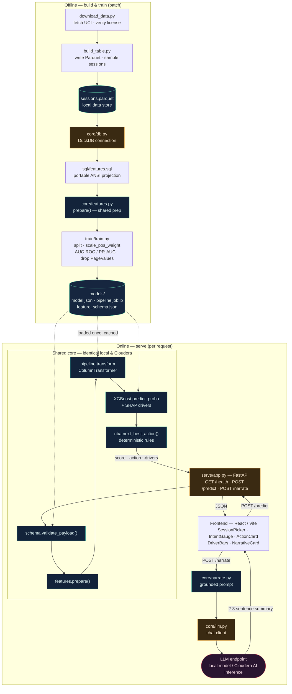
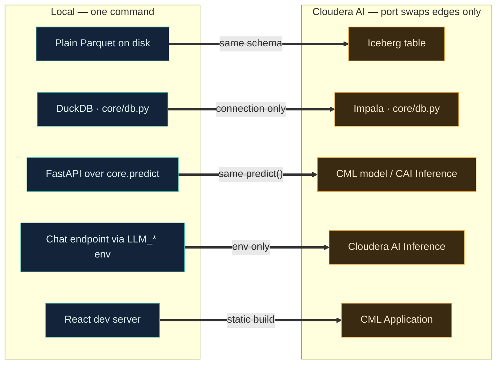

# Architecture

End-to-end view of the purchase-intent demo. The guiding principle is **shared core,
swappable edges**: all platform-specific concerns live behind thin edges (data
connection, serving wrapper, LLM client, frontend config). Porting to Cloudera AI swaps
the edges; it never rewrites the logic. See [PORTING.md](PORTING.md) for the exact swaps.

**Legend** — in the diagram below: dark-blue = shared core (identical local and ported),
amber = swappable edge, teal cylinders = data/artifact stores, purple = external service.

## End-to-end system

### Offline lifecycle (build once)
1. `data/download_data.py` fetches the public UCI dataset and verifies the license.
2. `data/build_table.py` writes `data/parquet/sessions.parquet` and a handful of demo
   sessions.
3. `sql/features.sql` (run through `core/db.py`, DuckDB locally) projects the portable
   feature source; `core/features.py` derives the shared feature vector.
4. `src/train/train.py` trains the XGBoost pipeline (drops `PageValues` to avoid leakage,
   handles class imbalance, reports AUC-ROC / PR-AUC) and writes three portable artifacts
   to `models/`.

### Online lifecycle (per request)
1. The React UI POSTs a raw session to `/predict`.
2. The shared core validates the payload against the schema, prepares features, transforms
   them with the fitted pipeline, scores with the booster, computes SHAP **drivers**, and
   attaches the deterministic **next-best-action** — returned together as one JSON object.
3. Separately, the UI POSTs to `/narrate`; `core/narrate.py` builds a prompt strictly from
   the model's own score, drivers, and action, and `core/llm.py` calls the LLM endpoint for
   a short plain-language summary. This layer is optional: if no endpoint is configured,
   `/narrate` reports `enabled: false` and the UI hides the card — scoring is unaffected.

## Shared core, swappable edges (local → Cloudera)

**Shared core (unchanged when porting):** `src/core/schema.py`, `src/core/features.py`,
`src/core/predict.py`, `src/core/nba.py`, `src/core/narrate.py`, `src/core/llm.py`, and
`sql/features.sql`.

**Edges (the only things that change):** the data connection (`src/core/db.py`), the
serving wrapper (`src/serve/app.py`), the LLM endpoint configuration (`LLM_*` env), and the
frontend's `VITE_API_BASE_URL`.
