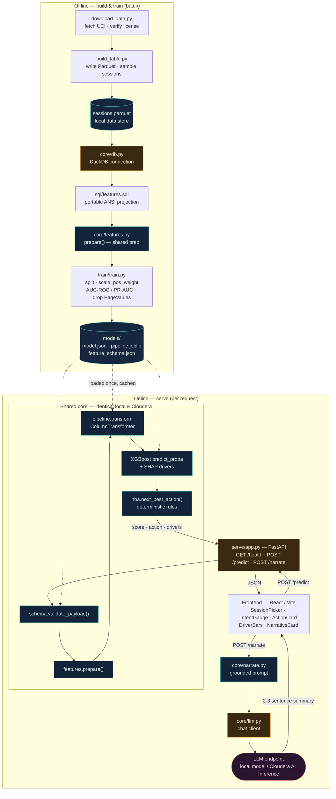

# Purchase Intent Scoring + Next Best Action

A self-contained demo that scores e-commerce sessions for purchase intent and returns a
deterministic next-best-action. It runs locally end to end, then ports cleanly to
Cloudera AI. The design follows one principle: **shared core, swappable edges**. All
platform-specific concerns (data connection, serving wrapper, frontend config) live
behind thin edges; porting swaps the edges and never rewrites the logic. See
[ARCHITECTURE.md](ARCHITECTURE.md) for an end-to-end diagram and [PORTING.md](PORTING.md)
for the local-to-Cloudera map.

The dataset is a public e-commerce clickstream (UCI Online Shoppers Purchasing Intention,
~12,330 sessions), the same shape as a typical Flume clickstream feed.

## Stack

| Layer | Local | Cloudera AI |
|---|---|---|
| Data store | Plain Parquet on disk | Iceberg table |
| Query engine | DuckDB | Impala |
| Model | XGBoost in an sklearn pipeline | same artifacts |
| Serving | FastAPI over `core.predict` | CML model endpoint or CAI Inference |
| Frontend | React (Vite) | CML Application |

## Architecture

End-to-end view. Dark-blue = shared core (identical local and ported), amber = swappable
edge, teal cylinders = data/artifact stores, purple = external service.



See [ARCHITECTURE.md](ARCHITECTURE.md) for the offline/online lifecycles and the
local&nbsp;→&nbsp;Cloudera edge-swap map.

## Prerequisites

- Python 3.11+ and `python3-venv`
- Node.js 18+ and npm

## Quick start (one command)

```bash
make demo
```

This creates a virtualenv (at `~/.venvs/bbb-intent-demo` by default, outside the repo so
cloud storage does not sync it), installs dependencies, downloads and builds the data,
trains the model, then starts the API and the web app together. Open
**http://localhost:5173** and pick a session.

Run individual stages instead:

```bash
make setup    # venv + Python deps + frontend deps + env files
make data     # download dataset, build Parquet + sample_sessions.json
make train    # train model, save artifacts, print metrics
make test     # SQL validation, feature parity, predict smoke test
make api      # FastAPI scoring endpoint on :8000
make web      # React dev server on :5173
```

## Configuration

Settings come from the environment, optionally via dotenv files. No paths or hosts are
hardcoded in committed code.

- `config/.env` (copied from `config/.env.example`): dataset URL, paths, `RANDOM_STATE`,
  scoring thresholds, and `CORS_ORIGINS`.
- `frontend/.env` (copied from `frontend/.env.example`): `VITE_API_BASE_URL`, the API
  base URL the web app calls.

## How it works

1. **Data** (`data/`): downloads the dataset (license verified before use), writes plain
   Parquet, and generates `sample_sessions.json` for the demo picker.
2. **Features** (`sql/features.sql` + `src/core/features.py`): the SQL is a portable,
   ANSI-plain projection that runs on DuckDB now and Impala later. All row-level feature
   derivation lives in `features.py`, which is shared by training and serving so there is
   no train/serve skew. A parity test asserts batch and single-row paths produce
   identical vectors.
3. **Train** (`src/train/train.py`): stratified split (seed 42), class imbalance handled
   with `scale_pos_weight`, evaluated with AUC-ROC and PR-AUC. Saves `model.json`
   (XGBoost native), `pipeline.joblib` (fitted preprocessing), and `feature_schema.json`
   (ordered shipped features).
4. **Predict** (`src/core/predict.py`): the single scoring function. Validates the
   payload against the schema, prepares features, scores, and attaches the
   next-best-action so the front end stays dumb.
5. **Serve** (`src/serve/app.py`): a thin FastAPI wrapper exposing `POST /predict`.
6. **Frontend** (`frontend/`): a session picker, an intent gauge, and the next-best-action.

## Optional: narrative explanations

The demo can call any hosted model endpoint that speaks the common chat-completions
HTTP API to add a 2-3 sentence plain-language summary of each scored session (the
"Analyst read" card). Set these in `config/.env`:

```
LLM_BASE_URL=...        # endpoint base URL (the client appends /chat/completions)
LLM_API_KEY=...         # bearer token, if the endpoint needs one
LLM_MODEL=...           # model name to request
LLM_TIMEOUT_SECONDS=20  # optional
```

The narrative is a separate `POST /narrate` call with its own thin contract:

| Case | Status | Body |
|---|---|---|
| Success | 200 | `{"enabled": true, "narrative": "Two to three sentences..."}` |
| No endpoint configured | 200 | `{"enabled": false, "narrative": null}` |
| Endpoint error or timeout | 200 | `{"enabled": true, "narrative": null}` |
| Invalid payload | 400 | `{"detail": "..."}` |

When unset, the UI simply hides the card. Scoring (`POST /predict`) never touches the
model endpoint, so the core demo is identical with or without it. Narratives are
generated strictly from the model's own score, drivers, and recommended action, and
successful generations are cached per session.

## Modeling note: PageValues

`PageValues` is a dominant, near-leakage feature. The **shipped model is trained without
it** so it scores on behavioral signals only. Training still prints a side-by-side
comparison so the leakage is documented:

| Model | AUC-ROC | PR-AUC |
|---|---|---|
| Shipped (without PageValues) | ~0.76 | ~0.35 |
| Comparison (with PageValues) | ~0.92 | ~0.72 |

The raw payload contract still accepts `PageValues`; the model simply ignores it.

## Project layout

```
config/    .env.example
data/      download_data.py, build_table.py, sample_sessions.json
sql/       features.sql            portable ANSI feature source
src/core/  schema.py, features.py, db.py, nba.py, predict.py   shared by train + serve
src/train/ train.py
src/serve/ app.py                  FastAPI over core.predict
models/    model.json, pipeline.joblib, feature_schema.json
frontend/  React (Vite) app, API base URL from env
tests/     SQL validation, feature parity, predict smoke test
```

## Tests

```bash
make test
```

Covers the portable SQL on DuckDB, batch/single-row/serve feature parity, and the
prediction envelope over all demo sessions.

## Data license

UCI Online Shoppers Purchasing Intention Dataset, licensed CC BY 4.0 (attribution
required). Cite: Sakar, C. & Kastro, Y. (2018). Online Shoppers Purchasing Intention
Dataset. UCI Machine Learning Repository. https://doi.org/10.24432/C5F88Q
